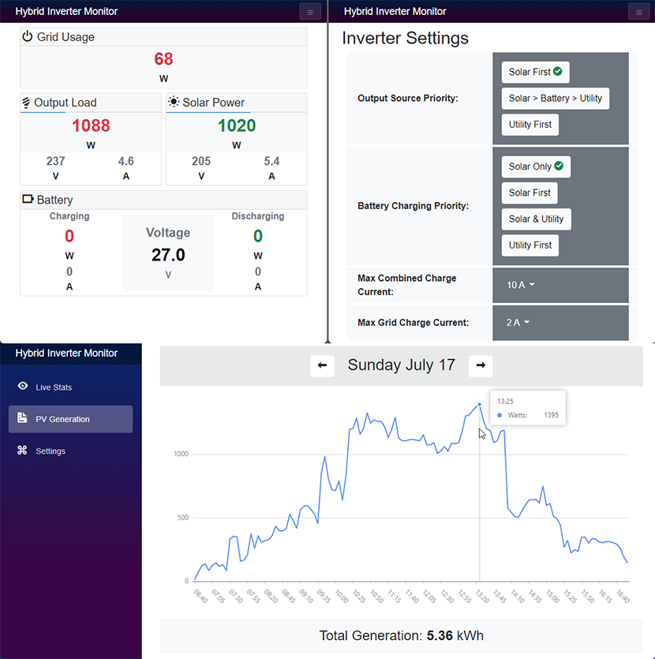

# Hybrid Inverter Monitor



---

This application allows you to monitor most chinese hybrid inverters such as `sako, epever, easun, mpp, voltronic, axpert, etc.` in realtime via USB port as an alternative to the wifi kit/module and cloud based apps such as smartess, watchpower, smartclient, etc. which can be at times unreliable.

For this to work, you need to connect a linux computer such as a raspberry/orange pi or any other linux computer to the inverter via USB cable. Windows will not work due to the non-existence of a working device driver.

Once your inverter is connected via USB, a new device path should appear in `/dev/hidraw0`. Once that's available and if your inverter supports the **Voltronic** communication protocol, all you have to do is execute the `InverterMon.Server` executable. The the binaries can be downloaded from the [releases section](https://github.com/dj-nitehawk/Hybrid-Inverter-Monitor/releases). Make sure to choose the correct architecture (x64/arm) for your machine.

After the application has started successfully, you can simply open up a web browser and navigate to `http://ip.address.of.machine` to see the dashboard. It may take up to 5 seconds for the data to show up initially.

If you have a firewall, please open port `80` to facilitate communication.

In order to make the application/server automatically start at bootup, follow the below procedure to create a `systemd` service.

# Auto Start Configuration Steps

open the following file (or the correct one for your OS):

`sudo nano /lib/udev/rules.d/99-systemd.rules`

add the following text to the end:
```
KERNEL=="hidraw0", SYMLINK="hidraw0", TAG+="systemd"
```

create a new file for the service

`sudo nano /etc/systemd/system/invertermon.service`

copy/paste the following:
```ini
[Unit]
Description=Hybrid Inverter Monitor
After=dev-hidraw0.device

[Service]
Type=simple
User=root
Group=root
UMask=000

#put the downloaded files in here
WorkingDirectory=/inverter
ExecStart=/inverter/InverterMon.Server

Restart=always
RestartSec=30

[Install]
WantedBy=multi-user.target
```
run the following commands to enable and start the service:
```
sudo systemctl enable invertermon
sudo systemctl start invertermon
sudo systemctl status invertermon
```
restart the machine to check if the service was configured correctly.

# JK BMS Support
If you have a JK BMS + JK RS485 adapter + USB->TTL adapter, simply wire them up correctly and plug it in to the computer. 
The app will try to connect to the BMS via serial port by default at address `/dev/ttyUSB0`. 
If your USB->TTL device is mounted at a different device path, simply upate the `appsettings.json` file with the correct path like so:
```json
{
  "LaunchSettings": {
    "JkBmsAddress": "/dev/ttyUSB1",
  }
}
```
